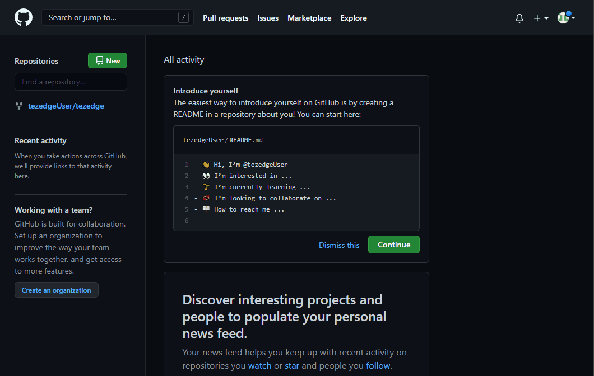

# Tezegde CI - Drone - Continuous Integration platform

Our CI of choice was [drone](https://www.drone.io/). The following readme was designed to apply to Ubuntu 18.04 and above.

## Prerequisites

- Be able to ssh into the desired target hosts with public key authentication with the **SAME** username and public key used on all the hosts
- For the real time runner, we restrict the hardware for a one of hetzner dedicated servers, specifically to [PX-93](https://www.hetzner.com/dedicated-rootserver/px93?country=by) to be able to install our custom compiled kernel with PREEMTP_RT patch

## Deploying a drone ci for tezedge repository

### 1. Creating an OAuth Application on github
- GitHub's documentation has a [step by step guide](https://docs.github.com/en/developers/apps/building-oauth-apps/creating-an-oauth-app)

- The most important is to set the:
    - `Application name`: A descriptive name of the Application (E.g.: Tezege Fork CI)
    - `Homepage URL`: The url of the `drone_server` with an empty path component (E.g.: http://ci.tezedgem.com)
    - `Authorization callback URL`: The url of the `drone_server` with a `login` path component (E.g.: http://ci.tezedgem.com/login)

- After we have created the OAuth app, we will be redirected to the configuration page. 

- Create a client secret and copy it. Be careful! You can only see the secret once. 

- Copy out the client id.

The whole process is captured on the following gif:



### 2. Create a shared secret

The shared secret is used to authenticate communication between runners and our `drone_server`.

- To create a shared secret, run the following command in a terminal
```
$ openssl rand -hex 16
bea26a2221fd8090ea38720fc445eca6
```

### 3. Install ansible

For comfortable automation, we have created ansible playbooks to deploy a drone ci setup with just a few commands

```
$ sudo apt update
$ sudo apt install software-properties-common
$ sudo add-apt-repository --yes --update ppa:ansible/ansible
$ sudo apt install ansible
```

### 4. Fork and clone the forked tezedge repository.

Fork is important if we want to run our own CI environment as the drone CI runs builds via github webhooks.

```
$ git clone https://github.com/tezedgeUser/tezedge.git

TODO: use this command until not merged into master
$ git clone https://github.com/tezedgeUser/tezedge.git --branch ci/ansible
```

Note: Please replace `tezedgeUser` in the link with your own github username. 

### 5. Edit variables and hosts 
    
Before we run the playbooks, we need to set a few variables that are used in the configuration. In the vars directory, we need to 
edit the [variables.yml](vars/variables.yml)

There are 6 variables we need to set before continuing

```
drone_server: The ip/hostname of the machine we wish to set as a server

# User with the ssh connects to the target machines
target_hosts_user: The username with sudo permissions on the target hosts

# The github username you wish to add as an admin for the drone CI
admin_user: The github username of the desired administrator

# Variables for drone server configuration
github_client_id: The client id of the OAuth app
github_client_secret: The client secret of the OAuth app 
rpc_secret: The generated shared secret for RPC communication
```

Example of a fully edited variables.yml file:

```
---

# The drone server
drone_server: 65.21.165.82

# User with the ssh connects to the target machines
target_hosts_user: dev

# The github username you wish to add as an admin for the drone CI
admin_user: tezedgeUser

# Variables for drone server configuration
github_client_id: a3e1b143f5cf193c3ef2
github_client_secret: a4421f712e07eca2ea0fd3f78934a5a5351f3a5e
rpc_secret: 96cac97a56ebe9419709cbffc0849292

# ** DO NOT EDIT THE VARIABLES BELOW THIS LINE **

# Path to the tezedge-ci data that needs to be acquired before running the ci
ci_data_path: "/home/{{ target_hosts_user }}"

# SSH configuration
ssh_strict_host_keys: 'no'
ssh_config_file: "/home/{{ target_hosts_user }}/.ssh/config"
...

```

The next file we should edit is the [hosts](inventory/hosts) file. This file is in ini format and contains all the hosts we wish to connect to.

Example of a fully edit host file:
```
[drone_server]
65.21.165.82

[drone_runners]
65.21.165.82
65.21.165.83

[real_time_runners]
65.21.165.84

```

You can add as many *drone_runners* or *real_time_runners* as we wish. Please be aware of the *real_time_runners* hardware prerequisites talked about earlier in this readme. Note that the `drone_server` can also run a drone_runner

### 6. Run the ansible playbooks

**Please keep in mind that we have to run these playbooks in this exact order**

Once all the variables and hosts are set we can proceed to execute the ansible playbooks. Please double check that we can connect to the target hosts with public key authentication. 

We use the `ansible-playbook` command to execute the playbooks. Here we provide a description for an example `ansible-playbook` command. Use the same user as the `target_hosts_user` we set in the variables.yml. 
```
$ ansible-playbook ./playbooks/docker_setup.yml --user dev --ask-become-pass -i ./inventory/hosts
                     |                              |          |                |
                     |                              |          |                -------> inventory file
                     |                              |          -------> sudo password for the user
                     |                              -------> the user we want to connect to the host
                     -------> the specific playbook we are running

```

After the we run the command, ansible will ask for the `BECOME` password. You must enter the user's password, so ansible can execute sudo commands on the host.

- The first one we run is [docker_setup](playbooks/docker_setup.yml). This playbook prepares the hosts for the docker containers that drone runs in. It installs all the prerequisite packages for docker and docker itself.

    ```
    $ cd drone_ci
    $ ansible-playbook ./playbooks/docker_setup.yml --user dev --ask-become-pass -i ./inventory/hosts
    ```

- As the next step, we run the [real_time_node_setup](playbooks/real_time_node_setup.yml). This playbook downloads and installs the required kernel for the real time environment. It ends in the reboot of the target host. Ansible will wait for the host to come online again. Again, please be aware of the *real_time_runners* hardware prerequisites talked about earlier in this readme.

    ```
    $ ansible-playbook ./playbooks/real_time_node_setup.yml --user dev --ask-become-pass -i ./inventory/hosts
    ```

- The next one to run is the [drone_server_setup](playbooks/drone_server_setup.yml). With this we set up and start the drone server.

    ```
    $ ansible-playbook ./playbooks/drone_server_setup.yml --user dev --ask-become-pass -i ./inventory/hosts
    ```

- As the final touch, we set up and run all the drone runners. These playbooks will also download all the data needed to run all of our tests in the CI.

    ```
    $ ansible-playbook ./playbooks/normal_drone_runner_setup.yml --user dev --ask-become-pass -i ./inventory/hosts
    $ ansible-playbook ./playbooks/real_time_drone_runner_setup.yml --user dev --ask-become-pass -i ./inventory/hosts
    ```
    Please note that both playbooks will stay on `Download data` task quite a long time as they are downloading approximately 29 GB of data for each host.
### 7. Enable and setup the tezedge repository 

After we ran all the playbooks above we can navigate to the `drone_server` url to enable the repository

Follow this gif to set up the CI:


With these few steps we enable the repository to send webhooks to our `drone_server`. We also enable the `Trusted` setting and set the pipeline timeouts to 4 hours. 

### 8. Add the drone runner ips/hosts to the synchronize_ci.sh script

This script handles the distribution of the build data across all the runners and can be found in the root of the repository [here](../synchronize_ci.sh) . We need to edit the `CI_HOSTS` array in the script to have all the `drone_runners` and `real_time_runners` included. 

## Run a build 

Done! We now have a fully configured drone CI with all the data required to run the test pipelines.

To run a build:

- Create a custom branch
```
$ git checkout -b ci/testing
```

- Commit all of the changes
```
$ git add . && git commit -m "Our new CI setup"
```

- Push the changes to the remote github repository

```
$ git push origin ci/testing
```

Now all we have to do is to create a pull request to the develop branch. After the pull request creation, we will notice a new build in our `drone_server` webpage. 